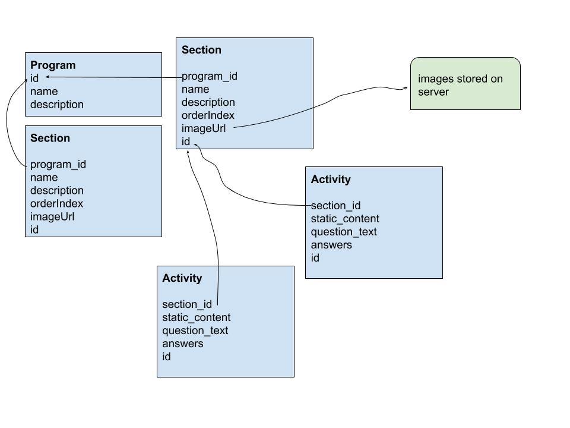

How to run: (assumes postgres is installed)
1. set environment variables:
export USERNAME=username for the db
export PGPASSWORD=password for the db
2. ./startup.sh --seed or ./startup.sh (will do all the imports)
or python run.py --seed or python run.py (will skip the imports)

Run tests:

`pipenv shell` 

`pytest`

To do:
- test serialization for the actual return values of the endpoints 
- functional test for the endpoints

API:
- client calls /api/v1/programs/list to get a list of all the programs available
- client calls /api/v1/program/<id> to get details on a specific program (returns both program details and section details)
- the detail api returns a response where each section has an imageUrl field; fetch the image associated with the section by going to the url provided

Future Improvements:
- add API for writes
- use defined schemas for the models / improve serialization
- add authentication 
- add users table to store what choice they select on multiple choice activities

